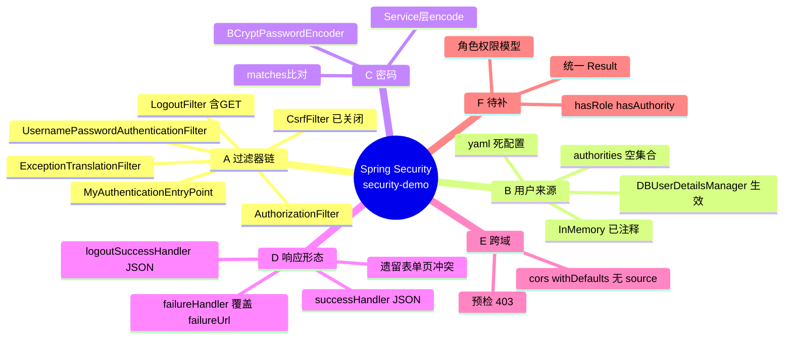

# security-demo

Spring Boot 3 + Spring Security 6 的学习仓库。仓库的主线是一步步换掉 Spring Security 的默认行为：默认拦截 → YAML 配用户 → 数据库取用户 → 密码加密 → 自定义登录页 → **前后端分离（把重定向换成 JSON 响应）**。

**当前状态两句话：**

1. 只完成了「认证」，没有「授权」——登录用户的权限列表是空的，安全规则只有 `anyRequest().authenticated()`。
2. 认证响应已经全部 JSON 化，但**跨域并没有真正配好**，且登录成功的响应体里**带着用户密码密文**。详见第 9 节。

| | |
| --- | --- |
| Spring Boot | 3.5.8（`spring-boot-starter-parent`） |
| Spring Security | 6.5.7（由 Boot 统一管理） |
| JDK | 21 |
| 持久层 | MyBatis-Plus 3.5.17 + MySQL 8.0 |
| 视图 | Thymeleaf（含 `thymeleaf-extras-springsecurity6`）—— 表单页仍在，但已与 JSON 响应模式冲突（见 6.4） |
| JSON | `jackson-databind`（显式引入，四个 handler 手写 `ObjectMapper`） |
| 其他 | Lombok、knife4j-openapi3 4.5.0（仅引依赖，未配置） |
| 入口 | `http://localhost:8080/demo/`（`server.servlet.context-path=/demo`） |

## 目录

1. [快速开始](#1-快速开始)
2. [项目结构](#2-项目结构)
3. [思维导图](#3-思维导图)
4. [支点一：请求进门要过的链](#4-支点一请求进门要过的链)
5. [支点二：用户从哪来](#5-支点二用户从哪来)
6. [支点三：响应形态 —— 从重定向到 JSON](#6-支点三响应形态--从重定向到-json)
7. [接口与安全规则对照](#7-接口与安全规则对照)
8. [实测记录](#8-实测记录)
9. [已知问题](#9-已知问题)
10. [下一步](#10-下一步)
11. [演进对照](#11-演进对照)

---

## 1. 快速开始

### 1.1 数据库

`security-demo` 库、`user` 表。下面是本机 `SHOW CREATE TABLE` 的真实结果：

```sql
CREATE DATABASE IF NOT EXISTS `security-demo` DEFAULT CHARSET utf8mb4 COLLATE utf8mb4_0900_ai_ci;
USE `security-demo`;

CREATE TABLE `user` (
  `id`       int NOT NULL AUTO_INCREMENT,
  `username` varchar(50)  DEFAULT NULL,
  `password` varchar(500) DEFAULT NULL,
  `enabled`  tinyint(1) NOT NULL,
  PRIMARY KEY (`id`),
  UNIQUE KEY `user_username_uindex` (`username`)
) ENGINE=InnoDB DEFAULT CHARSET=utf8mb4 COLLATE=utf8mb4_0900_ai_ci;
```

表名 `user` 由 MyBatis-Plus 的「驼峰转下划线」策略从实体 `User` 推导，实体没写 `@TableName`。

**`password` 必须存 BCrypt 密文**，否则登不进去（`BCryptPasswordEncoder.matches` 对明文永远 false）。要一个确定能登进去的账号，插这行（明文 `123456`，密文由 `BCryptPasswordEncoder` 生成并 `matches` 回验过）：

```sql
INSERT INTO `user` (username, password, enabled)
VALUES ('demo', '$2a$10$6bXYvRC569TQclTaQ0b/6OU1Dyz0PThAEeG.MbnxSxxFBrTTBTXSC', 1);
```

> 别指望用 `/user/save` 接口自举：它同样在 `anyRequest().authenticated()` 之下，而登录又要求库里已有用户，两者互为前置。

### 1.2 连接配置

`application.yaml` 里写死了本机口令（`root / 123456`）。URL 用 `jdbc:mysql:///security-demo`，省略 host 即本机；库名含连字符所以不能省。

⚠️ 这是真实口令且已随历史提交进仓库，若 repo 设为 public 会一并公开。要收敛就得换成 `${MYSQL_PASSWORD}` 之类的占位并改写历史。

### 1.3 启动

IDEA 里直接跑 `SecurityDemoApplication` 最省事。命令行有两个环境坑：

```bash
export JAVA_HOME="D:/dev/jdk/jdk21.0.12.1"          # 坑 1：PATH 上的 java 是 17，pom 要 21
mvn -o spring-boot:run \
    -Dmaven.repo.local=D:/dev/maven/apache-maven-3.9.9/repository \
    -Dspring-boot.run.arguments=--server.port=8081   # 坑 2：命令行 mvn 的仓库和 IDEA 不是同一个
```

端口 8081 是为了和 IDEA 已跑的实例并存；只要端口空着，去掉那行即可。

### 1.4 验证清单

现在未认证请求**不再跳转**，而是直接吐 JSON，所以用 curl 比用浏览器直观：

| 命令 | 期望现象 |
| --- | --- |
| `curl -i localhost:8080/demo/` | `200` + `{"code":-1,"message":"认证失败，需要登录"}`，**不是** 302 到登录页 |
| `curl -i -X POST localhost:8080/demo/login -d "myusername=demo&mypassword=wrong"` | `200` + `{"code":-1,"message":"用户名或密码错误"}` |
| 同上但密码正确 | `200` + `{"code":0,"message":"登录成功","data":{...}}`，`data` 里含 `password` 密文（见 6.3）。**这一行是推断，未实测** |
| `curl -i localhost:8080/demo/logout` | `200` + `{"code":0,"message":"登出成功"}`（GET 也能登出，因为 CSRF 又关了） |
| `curl -i localhost:8080/demo/login` | 表单页还在，`<form>` 里**没有** `_csrf` 隐藏域 |
| 前端 `fetch` 跨源调接口 | **会被浏览器拒绝**，`.cors(withDefaults())` 目前等于没配（见 6.6） |

---

## 2. 项目结构

```
src/main/java/com/ittxf/securitydemo
├── SecurityDemoApplication.java
├── config
│   ├── WebSecurityConfig.java             所有安全规则 + 四个 handler 的接线处
│   ├── DBUserDetailsManager.java          数据库版 UserDetailsService / UserDetailsManager
│   ├── MyAuthenticationEntryPoint.java     未认证 → JSON「认证失败，需要登录」
│   ├── MyAuthenticationSuccessHandler.java 登录成功 → JSON，data = principal
│   ├── MyAuthenticationFailureHandler.java 登录失败 → JSON，message = 异常消息
│   └── MyLogoutSuccessHandler.java        登出成功 → JSON「登出成功」
├── controller
│   ├── IndexController.java               GET  /            → templates/index.html
│   ├── LoginController.java               GET  /login       → templates/login.html
│   └── UserController.java                GET  /user/list   POST /user/save
├── entity/User.java                       id / username / password / enabled
├── mapper/UserMapper.java                 extends BaseMapper<User>
└── service
    ├── UserService.java                   extends IService<User> + saveUserDetails
    └── impl/UserServiceImpl.java          先 encode 再交给 UserDetailsManager 落库

src/main/resources
├── application.yaml                        数据源、context-path=/demo、yaml 用户（已失效）、SQL 日志
├── mapper/UserMapper.xml                   只声明 namespace
└── templates
    ├── index.html                           首页 + 两个 GET Logout 链接
    └── login.html                           表单页（注意：里面的 _csrf 注释已与现状不符）

src/test/java/.../SecurityDemoApplicationTests.java   testPasswordEncoding：BCrypt 编码/校验演示
```

四个 handler 高度雷同：都是 `@Component` + 注入 `ObjectMapper` + 手搓 `HashMap` + `response.getWriter().write(json)`。抽一个 `Result<T>` 和公共写 JSON 的方法是自然的下一步。

---

## 3. 思维导图

```
Spring Security（security-demo）
│
├── A. 请求进门要过的链 ──── 第 4 节
│   ├── SecurityContextHolderFilter    Session 里取 SecurityContext
│   ├── CsrfFilter                     ← 现在 csrf.disable()，等于不校验
│   ├── LogoutFilter                   CSRF 关闭 → GET/POST/PUT/DELETE 都匹配
│   ├── UsernamePasswordAuthenticationFilter   参数名 myusername / mypassword
│   ├── ExceptionTranslationFilter     兜 AccessDeniedException
│   │   └── MyAuthenticationEntryPoint ★未认证不再 302，直接 JSON
│   └── AuthorizationFilter            anyRequest().authenticated()
│
├── B. 用户从哪来 ──── 第 5 节
│   ├── ① yaml spring.security.user        → 已被覆盖，死配置
│   ├── ② InMemoryUserDetailsManager       → 整段注释保留
│   └── ③ DBUserDetailsManager ★生效中
│       ├── loadUserByUsername → user 表
│       ├── authorities = new ArrayList<>()  ← 「能登录、零权限」的根因
│       └── 增删改 / userExists / updatePassword 仍是空桩
│
├── C. 密码怎么算
│   ├── PasswordEncoder Bean = BCryptPasswordEncoder（工作因子 10）
│   ├── 写在 UserServiceImpl.encode()，createUser 只负责原样入库
│   └── 读在 DaoAuthenticationProvider.matches()
│
├── D. 响应形态：重定向 → JSON ──── 第 6 节
│   ├── successHandler   覆盖「成功后跳原地址」
│   ├── failureHandler   覆盖 failureUrl("/login?failure") ← 后者已成死代码
│   ├── logoutSuccessHandler  覆盖 logout 的 302
│   ├── authenticationEntryPoint 覆盖未认证的 302
│   └── 遗留冲突：login.html / index.html 仍是服务端表单流
│
├── E. 跨域
│   └── .cors(withDefaults()) —— 容器里没有 CorsConfigurationSource，等于没开（实测预检 403）
│
├── F. CSRF 开关（翻了三次，当前＝关闭）
│   ├── ① formLogin(withDefaults())  默认开启
│   ├── ② csrf.disable()              为方便 curl 关闭
│   ├── ③ 注释掉 disable（恢复开启）  自定义登录页那版
│   └── ④ 又 csrf.disable()（当前）   为了 JSON handler 好调
│
└── G. 还没做
    ├── 角色/权限模型（库里只有 user 表）
    ├── hasRole / hasAuthority / @PreAuthorize
    ├── 统一响应体 Result<T>
    └── 真正的 CORS 配置、注册接口 permitAll
```



---

## 4. 支点一：请求进门要过的链

`spring-boot-starter-security` 一引入，`FilterChainProxy` 就挂进 Servlet 过滤器链，默认所有请求都要认证。本项目在 `WebSecurityConfig.filterChain()` 里定制它：

```
未认证 GET /demo/user/list
 CsrfFilter                    已禁用，直通
 UsernamePasswordAuthenticationFilter  不是 POST /login，直通
 LogoutFilter                  不是 /logout，直通
 AuthorizationFilter           匿名身份 + anyRequest().authenticated() → AccessDeniedException
 ExceptionTranslationFilter    身份是匿名 → 交给 entry point（不报 403）
 MyAuthenticationEntryPoint    ★ 200 + {"code":-1,"message":"认证失败，需要登录"}
                               （框架默认的 LoginUrlAuthenticationEntryPoint 被整个替换，
                                 所以浏览器不会再自动跳 /demo/login）

POST /demo/login（参数 myusername / mypassword）
 UsernamePasswordAuthenticationFilter
   └─ ProviderManager → DaoAuthenticationProvider
        ├─ DBUserDetailsManager.loadUserByUsername → user 表
        ├─ BCryptPasswordEncoder.matches(明文, 库中密文)
        └─ 账号状态检查：库里 enabled=0 → DisabledException
   ├─ 成功 → MyAuthenticationSuccessHandler   200 JSON，data = authentication.getPrincipal()
   └─ 失败 → MyAuthenticationFailureHandler   200 JSON，message = 异常本地化消息
             （代码里 .failureUrl("/login?failure") 写在 .failureHandler() 之前，已被覆盖）

/logout（GET 或 POST，因为 CSRF 关着）
 LogoutFilter → 清 SecurityContext 与 Session → MyLogoutSuccessHandler  200 JSON
```

一处容易看漏的：`WebSecurityConfig` 上 `@RequiredArgsConstructor` + 四个 `private final` handler，靠构造器注入把 `@Component` 的 handler 接进配置，这是当前写法。

## 5. 支点二：用户从哪来

| 方案 | 位置 | 状态 |
| --- | --- | --- |
| YAML 用户 | `spring.security.user.name/password` | **已失效**。容器里有自定义 `UserDetailsService` 后，Boot 的 `UserDetailsServiceAutoConfiguration` 退让 |
| 内存用户 | `WebSecurityConfig` 里注释掉的 `InMemoryUserDetailsManager` | 未启用。它的价值是示范 `roles("USER")` 怎么塞权限 |
| 数据库用户 | `DBUserDetailsManager`（`@Component`） | **生效中** |

`DBUserDetailsManager` 方法签名里没出现 `UserDetailsService`，却被当成取用户的入口，靠的是一条继承关系：

```java
public class DBUserDetailsManager implements UserDetailsManager, UserDetailsPasswordService
//                                    ↑ 继承链上游就是 UserDetailsService
```

于是它是容器里唯一的 `UserDetailsService` Bean，`InitializeUserDetailsBeanManagerConfigurer` 用它构造 `DaoAuthenticationProvider` 并注入 `BCryptPasswordEncoder`。

密码怎么算：`BCryptPasswordEncoder` 默认工作因子 10（测试用例里用 `(4)` 只求跑得快）；自带随机盐，同一明文每次密文不同；密文恒 60 字符且成本记在串里（`$2a$10$...`），所以 `varchar(500)` 绰绰有余。库里现有的 4 行 `password` 长度都是 60，是合规密文。

`loadUserByUsername` 返回值的最后一参是关键：

```java
new User(username, password, enabled, true, true, true,
         new ArrayList<>() /* ← 权限为空，一切授权玩法都从这里开始 */);
```

## 6. 支点三：响应形态 —— 从重定向到 JSON

### 6.1 四个 handler 各自顶掉了什么

| 接线 | 顶掉的默认行为 | 现在的响应 |
| --- | --- | --- |
| `.successHandler(...)` | `SavedRequestAwareAuthenticationSuccessHandler`（成功后跳回原地址） | 200 JSON，`data` = `UserDetails` |
| `.failureHandler(...)` | `.failureUrl("/login?failure")` | 200 JSON，`message` = 异常消息 |
| `.authenticationEntryPoint(...)` | 302 到登录页 | 200 JSON `认证失败，需要登录` |
| `.logoutSuccessHandler(...)` | 302 到 `/logout?success` | 200 JSON `登出成功` |

四个 handler **都没有任何 `sendRedirect`**，所以整个应用的认证交互已经从「页面跳转」变成「接口调用」。

### 6.2 `failureUrl` 现在是死代码

```java
.formLogin(form -> form
    .loginPage("/login")
    .permitAll()
    .usernameParameter("myusername")
    .passwordParameter("mypassword")
    .failureUrl("/login?failure")            // ← 先设
    .successHandler(myAuthenticationSuccessHandler)
    .failureHandler(myAuthenticationFailureHandler)  // ← 后设，把 failureUrl 顶掉了
)
```

`failureUrl()` 内部就是把一个 `SimpleUrlAuthenticationFailureHandler` 装成失败处理器，后写的 `failureHandler()` 直接覆盖它。实测：错误密码返回的是 JSON，**没有** 302 到 `/demo/login?failure`，`login.html` 里 `th:if="${param.failure}"` 那段「错误的用户名和密码.」也就再也不会出现。

留一个还是留另一个，取决于要不要继续维护服务端表单页；两边都留就是现在这种迷惑状态。

### 6.3 登录成功的响应体会泄露密码密文

`data` 放的是 `authentication.getPrincipal()`，也就是 `loadUserByUsername` 造出来的 `org.springframework.security.core.userdetails.User`。Jackson 会把它的 public getter 全序列化出来（我用同一构造方式跑过探针）：

```json
{"code":0,"message":"登录成功",
 "data":{"password":"$2a$10$6bXYvRC569TQclTaQ0b/...","username":"demo","authorities":[],
         "accountNonExpired":true,"accountNonLocked":true,"credentialsNonExpired":true,"enabled":true}}
```

`password` 就這麼被送到前端了。收口办法：`data` 只放自建的 `LoginUserVO`（username/昵称/权限），或给 `UserDetails` 的实现类加 `@JsonIgnore`；同时 `/user/list` 直接序列化 `entity.User` 也带 `password`，同一类问题。

### 6.4 表单页与 JSON 模式现在互相打架

`loginPage("/login")` + `LoginController` + `login.html` 这套服务端页面是上一阶段的产物，现在留着会有三个后果：

1. 未认证访问 `/demo/` 不再跳登录页，浏览器只会显示一段 JSON；想手动打开 `http://localhost:8080/demo/login` 才能看到那张表单。
2. 表单是 `method="post"` 的真实提交，登录成功后浏览器会**导航**到 handler 写出的那段 JSON 文本（停在 `{"code":0,...}` 上），不会自动进首页。
3. 页面里那行注释「表单中会自动生成 _csrf 隐藏字段」现在**与事实相反**：CSRF 已重新禁用，实测 `GET /demo/login` 的 `<form>` 里没有 `_csrf`。

真正的前后端分离形态通常是：后端只留接口 + JSON，前端自己渲染登录页；或者反过来保留表单流、handler 里做条件跳转。先选定一条，另一套代码就该删。

### 6.5 CSRF 开关改的东西比你想的多

`csrf.disable()` 在本仓库被翻了三次（见思维导图 F）。它至少牵动三件事：

| 影响 | CSRF 开启 | CSRF 关闭（当前） |
| --- | --- | --- |
| 写请求 | 必须带 `_csrf`（`th:action` 表单会自动注入；JSON 请求要放 `X-CSRF-TOKEN` 头） | 不需要，curl 直接打 |
| `/logout` 的匹配方法 | 只匹配 `POST /logout` | `GET/POST/PUT/DELETE` 全匹配，所以 `index.html` 里 `th:href` 那个 GET 链接现在能用（点了会返回一段 JSON）；另一个写死 `href="/logout"` 的因为少了 `/demo` 前缀，仍然打不到（9.6） |
| 浏览器表单登录 | 正常 | 正常，但少了防护 |

两次实测对得上这个分支：CSRF 开启时 `GET /demo/logout` 是 302 到登录页（说明 `LogoutFilter` 没匹配 GET），关掉后同一请求返回 `{"code":0,"message":"登出成功"}`。

### 6.6 跨域：`.cors(withDefaults())` 现在等于没配

`withDefaults()` 的 `CorsConfigurer` 会去容器里找一个 `CorsConfigurationSource` Bean；**找不到就没有任何映射**。全仓库搜 `CorsConfigurationSource` / `@CrossOrigin` / `addCorsMappings` 都没有命中，于是：

- 预检 `OPTIONS /demo/user/list` → **403**，响应里没有任何 `Access-Control-Allow-*`（实测）；
- 带 `Origin` 的普通请求 → 200，但**不返回** `Access-Control-Allow-Origin`，浏览器照样拦。

也就是说「跨域问题解决了吗」= 没有，只是把 CORS 的插槽挂上了。补一个 Bean 即可（下面这段我没实机验证，是标准写法）：

```java
@Bean
public CorsConfigurationSource corsConfigurationSource() {
    CorsConfiguration cfg = new CorsConfiguration();
    cfg.setAllowedOriginPatterns(List.of("http://localhost:5173"));  // 带 Cookie 时不能用 "*"
    cfg.setAllowedMethods(List.of("GET", "POST", "OPTIONS"));
    cfg.setAllowedHeaders(List.of("*"));
    cfg.setAllowCredentials(true);   // 本项目的会话靠 JSESSIONID Cookie，跨源必须开
    UrlBasedCorsConfigurationSource src = new UrlBasedCorsConfigurationSource();
    src.registerCorsConfiguration("/**", cfg);
    return src;
}
```

别忘了前端也要 `credentials: 'include'`，否则 Cookie 不带过去，登录后第二个请求仍是未认证。

## 7. 接口与安全规则对照

所有路径带 `/demo` 前缀。

| 方法 | 路径 | 安全要求 | 未认证时 | 已认证/成功时 |
| --- | --- | --- | --- | --- |
| GET | `/demo/` | `authenticated()` | 200 JSON「认证失败，需要登录」 | `index.html` |
| GET | `/demo/login` | `permitAll()` | 200 表单页（无 `_csrf`） | 同左 |
| POST | `/demo/login` | 免认证（框架接管） | — | 200 JSON（`data` 含密文）/ 失败 200 JSON |
| GET | `/demo/user/list` | `authenticated()` | 200 JSON | 用户数组，含 `password` |
| POST | `/demo/user/save` | `authenticated()` | 200 JSON（要登录才能注册） | 无响应体（`void`） |
| GET/POST | `/demo/logout` | 任意方法（CSRF 已关） | 200 JSON「登出成功」 | 同左 |
| GET | `/demo/doc.html` | `authenticated()` | 200 JSON | 未实测 |

## 8. 实测记录

**本轮**：2026-09-22 20:30 前后，用当前代码（`0bc4f1e`）另起一个实例在 8081 上测，只做读操作与失败登录，未写库；8080 上你自己的实例没动。

| 探针 | 结果 |
| --- | --- |
| `GET /demo/user/list`（未认证） | `200 application/json;charset=utf-8` → `{"code":-1,"message":"认证失败，需要登录"}` |
| `GET /demo/`（未认证） | 同上，**没有 302** |
| `POST /demo/login`（错误密码，无 `_csrf`） | `200` → `{"code":-1,"message":"用户名或密码错误"}`，**没有** 302 到 `?failure` |
| `GET /demo/logout` | `200` → `{"code":0,"message":"登出成功"}`（GET 被 `LogoutFilter` 匹配 = CSRF 已关） |
| `GET /demo/login` | 表单正常渲染，`<form action="/demo/login" method="post">` 里**没有** `_csrf` 隐藏域 |
| `OPTIONS /demo/user/list`，`Origin: http://localhost:5173` | **403**，无 `Access-Control-Allow-*` |
| `GET /demo/login` 带 `Origin` | `200`，但无 `Access-Control-Allow-Origin` |
| Jackson 探针（与 `loadUserByUsername` 同样构造 `User` 后序列化） | 输出含 `"password":"$2a$10$..."` → 证实 6.3 |

**未验证**：登录成功、`/user/save` 端到端、登录后 `/demo/doc.html` 是否可用 —— 本机库里那 4 行的明文我不知道，也不方便替你插账号。上面 1.4 表里对应那两行是照 handler 代码推的。

复现脚本（换个能登录的账号）：

```bash
B=http://localhost:8080/demo
curl -s -o /dev/null -w "%{http_code} -> %{redirect_url}\n" "$B/"                 # 期望 200，无跳转
curl -s -X POST "$B/login" -d "myusername=demo&mypassword=123456" -i | head -1    # 期望 200 JSON
curl -s -X OPTIONS "$B/user/list" -H "Origin: http://localhost:5173" \
            -H "Access-Control-Request-Method: GET" -i | head -1                  # 配好 CORS 前应变成 200
```

## 9. 已知问题

按「会不会马上咬到你」排序：

1. **跨域其实没配。** `.cors(withDefaults())` 缺 `CorsConfigurationSource`，预检 403。前端联调第一步就会撞上，改法见 6.6。
2. **登录成功响应带出密码密文。** `data` 直接放 `UserDetails`，实测序列化结果含 `password`（6.3）。`/user/list` 同理带密文。
3. **表单流和 JSON 流混着留。** 未认证不再跳登录页、表单成功后浏览器停在 JSON、`failureUrl` 与 `${param.failure}` 全成死代码（6.2、6.4）。选一条路。
4. **`login.html` 的注释在说反话。** 它写「`th:action` 会自动生成 `_csrf` 隐藏字段」，但当前 CSRF 是关的，实测页面上没有该字段。留着会误导后来读的人。
5. **CSRF 处于关闭状态。** 学习期为了 curl 方便可以理解，但要记得它是登录态应用的主要防线之一；重新打开后 `/logout` 只认 POST，`index.html` 的 GET 链接会立刻失效（6.5）。
6. **`index.html` 的 Logout2 写死 `href="/logout"`**，少了 `/demo` 前缀，无论 CSRF 开不开都打不到应用（实测 `GET /` 不带前缀是 404）。Logout1 用了 `th:href`，倒是正常。
7. **注册要登录**：`/user/save` 返回的是「认证失败，需要登录」，空库无法自举（1.1）。给它 `permitAll()`。
8. **只做了认证，没做授权。** `authorities` 恒空，任何登录用户能访问一切接口。
9. **没有统一响应体。** 四个 handler 各搓一个裸类型 `HashMap`（`HashMap result = new HashMap()`，未加泛型），`code`/`message` 语义也各写各的；`UserController.add` 返回 `void`，前端拿不到结果。
10. **`DBUserDetailsManager` 五个方法空着**：`updateUser`、`deleteUser`、`changePassword`、`userExists`（恒 `false`）、`updatePassword`（恒 `null`）。前四个是功能缺失；`updatePassword` 是隐患——该类同时是 `UserDetailsPasswordService` Bean，库里密码一旦不是 BCrypt 格式，`DaoAuthenticationProvider` 会拿 `null` 继续当 `UserDetails` 用，6.5.7 没判空，直接 NPE。
11. **注册没防重**：`createUser` 直接 `insert`，`username` 有唯一索引，撞了抛 `DuplicateKeyException`，接口没有异常处理会是 500（按代码推断，未实测）。
12. **`application.yaml` 的 `spring.security.user` 是死配置**（第 5 节解释了为什么），且数据库口令明文入库进仓库了。
13. **knife4j 只有依赖没有配置**，`/demo/doc.html` 又被 `authenticated()` 挡住。
14. 小清理：`WebSecurityConfig` 里 `import static ...withDefaults` 现在只被 `.cors(withDefaults())` 用着，但注释掉的 `httpBasic` 那行和整段内存用户代码可以清了。

## 10. 下一步

授权这条主线没变，顺序仍然是「先装权限，再让规则去读」：

1. 建表 `role` / `permission` / `user_role` / `role_permission`（先跑通 `user_role` 就够）。
2. `loadUserByUsername` 里查出权限，映射成 `List<GrantedAuthority>` 换掉那个 `new ArrayList<>()`。
3. 规则写在 `anyRequest()` **之前**：`.requestMatchers("/user/**").hasRole("ADMIN")` / `.hasAuthority("user:list")`。顺序错了会被前面的规则先吃掉。
4. 方法级：`@EnableMethodSecurity` + `@PreAuthorize("hasAuthority('user:save')")`。
5. `roles("USER")` 会加 `ROLE_` 前缀，`hasRole("USER")` 找的是 `ROLE_USER`；`authorities("user:list")` 不加前缀，配 `hasAuthority`。混用是新手期最常见的 403 来源。

按当前形态，我建议先顺手做掉这几件小事：补 `CorsConfigurationSource`、把 `data` 换成 VO、抽 `Result<T>`、注册接口 `permitAll()`、选定表单流或 JSON 流并删掉另一套。

## 11. 演进对照

| 提交 | 内容 |
| --- | --- |
| `9dc5dbe` 初始化 commit | Web + Thymeleaf 骨架，`IndexController`、`index.html` |
| `650488b` 使用 configuration 和 yaml 配置登录用户信息 | 引 starter；`WebSecurityConfig`（`PasswordEncoder`、`SecurityFilterChain`、`formLogin(withDefaults())`）；yaml 用户；注释版内存用户 |
| `a8b6f29` user 三层业务 | MyBatis-Plus + MySQL；entity/mapper/service/controller；`GET /user/list` |
| `40637d2` 基于数据的用户信息管理器 | `DBUserDetailsManager` 实现 `UserDetailsManager` + `UserDetailsPasswordService` |
| `1aa4b78` 增加新增用户功能 | `POST /user/save` → `createUser` 落库（此时明文入库） |
| `967632c` 密码加密算法以及校验规则 | `UserServiceImpl` 注入 `PasswordEncoder`，encode 后落库；`csrf.disable()`；`testPasswordEncoding`；加 knife4j |
| `61e4498` 自定义登录页面，恢复CSRF校验 | `LoginController` + `login.html`；`formLogin` 换 lambda（`loginPage`/`permitAll`/自定义参数名/`failureUrl`）；注释掉 `csrf.disable()`；`context-path=/demo` |
| `52c8467` 前后端分离：登录成功 JSON 化 | `MyAuthenticationSuccessHandler` + `.successHandler()`；`WebSecurityConfig` 改 `@RequiredArgsConstructor` 构造器注入；加 `jackson-databind` 依赖 |
| `0bc4f1e` 登录失败/登出/未认证 JSON 化 + 跨域 | `MyAuthenticationFailureHandler`、`MyLogoutSuccessHandler`、`MyAuthenticationEntryPoint`；`.failureHandler()`（顶掉 `failureUrl`）、`.logout()`、`.exceptionHandling()`；**`.cors(withDefaults())`**；**`csrf.disable()` 取消注释（第三次翻转，当前为关闭）** |
