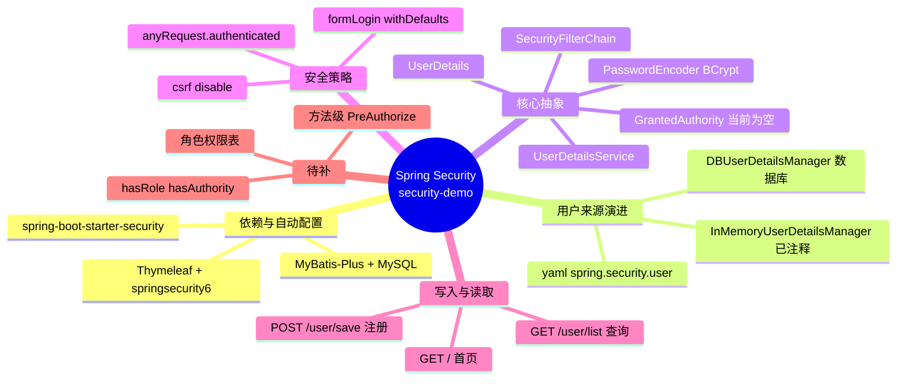

# security-demo · Spring Security 入门实践

一个从「零配置默认拦截」逐步演进到「数据库用户登录」的 Spring Security 最小项目，用于学习 Spring Security 的认证与授权骨架。

- Spring Boot 3.5.8 / Java 21 / Spring Security 6.5.7（版本由 Boot 统一管理）
- MyBatis-Plus 3.5.17 + MySQL + HikariCP
- Thymeleaf（含 `thymeleaf-extras-springsecurity6`）
- Lombok、knife4j-openapi3（依赖已引入，尚未配置）

> 本文只描述仓库里**已经存在**的代码。未实现的部分集中在 [已知缺口](#7-已知缺口与下一步)。

---

## 1. 目录结构

```
src/main/java/com/ittxf/securitydemo
├── SecurityDemoApplication.java        启动类
├── config
│   ├── WebSecurityConfig.java          PasswordEncoder + SecurityFilterChain
│   └── DBUserDetailsManager.java       基于数据库的 UserDetailsService/UserDetailsManager
├── controller
│   ├── IndexController.java            GET /            → templates/index.html
│   └── UserController.java             GET /user/list   POST /user/save
├── entity/User.java                    id / username / password / enabled
├── mapper/UserMapper.java              extends BaseMapper<User>
└── service
    ├── UserService.java                extends IService<User> + saveUserDetails
    └── impl/UserServiceImpl.java       密码加密后交给 UserDetailsManager 落库

src/main/resources
├── application.yaml                    数据源、yaml 用户配置、SQL 日志
├── mapper/UserMapper.xml               仅声明 namespace，SQL 全部走 BaseMapper
└── templates/index.html                首页 + 两个 Logout 链接
```

---

## 2. 思维导图

```
Spring Security 权限管理
├── 依赖：spring-boot-starter-security（默认拦截全部请求 + 随机密码日志）
├── 用户来源（后者覆盖前者）
│   ├── application.yaml：spring.security.user.name=admin password=123
│   ├── InMemoryUserDetailsManager（WebSecurityConfig 中已注释保留）
│   └── DBUserDetailsManager：从 user 表加载
├── 核心抽象
│   ├── SecurityFilterChain   规则入口
│   ├── UserDetails           用户主体（含账号状态与 authorities）
│   ├── UserDetailsService    认证取用户 SPI
│   ├── PasswordEncoder       BCryptPasswordEncoder
│   └── GrantedAuthority      权限条目（当前为空集合）
├── 当前策略：anyRequest().authenticated() + formLogin() + csrf.disable()
├── 写入侧：POST /user/save → encode → createUser → user 表
└── 缺口：角色权限模型、hasRole/hasAuthority、方法级安全、部分 UserDetailsManager 方法为空
```

Mermaid 版本（支持的渲染器会显示为导图）：



---

## 3. 权限管理是怎么一步步建起来的

对应 5 次提交，加上当前工作区里尚未提交的一批改动：

### 第 1 步：只要引入 starter，安全就已经生效
`spring-boot-starter-security` 一上，`FilterChainProxy` 就注册进 Servlet 过滤器链，默认策略是**所有请求都要认证**。此时访问 `GET /` 会跳 `/login`，密码是启动时打印的 `Using generated security password: ...`。

### 第 2 步：用 YAML 把用户固定下来
`application.yaml` 里配 `spring.security.user.name=admin / password=123`，走 Boot 的 `UserDetailsServiceAutoConfiguration`，本质仍是一个内存用户。这一步的价值是「不用改代码就能登录」。

### 第 3 步：用 Java 配置接管策略与密码形态
`WebSecurityConfig`：

- `@EnableWebSecurity` 显式开启 Web 安全（Boot 下可省略，此处保留以示教）
- `filterChain(HttpSecurity)` 声明三件事：
  - `authorizeHttpRequests(... .anyRequest().authenticated())` —— 需要认证
  - `formLogin(withDefaults())` —— 表单登录，自动登录页 `/login`，登录成功后跳回原请求
  - `csrf(csrf -> csrf.disable())` —— 关闭 CSRF，方便用 POST 接口直连调试（**这一行还没提交**，见第 8 节）
- `passwordEncoder()` 暴露 `BCryptPasswordEncoder`，此后密码必须以 BCrypt 密文比对
- 注释掉的 `InMemoryUserDetailsManager` 是第三种方案：代码内建用户 + `roles("USER")`，也是后面理解「角色」的对照组

### 第 4 步：用户改从数据库来（本项目核心）
`DBUserDetailsManager` 标注 `@Component`，同时实现 `UserDetailsManager` 与 `UserDetailsPasswordService`：

```java
UserDetails loadUserByUsername(String username)  // LambdaQueryWrapper 按 username 查 user 表
```

关键点在于**这个类方法签名里根本没出现 `UserDetailsService`，却依然被框架当成了取用户的入口**：`UserDetailsManager extends UserDetailsService`，所以它就是容器里唯一的 `UserDetailsService` Bean。Spring Security 的 `InitializeUserDetailsBeanManagerConfigurer` 会用它构建 `DaoAuthenticationProvider`（并把 `BCryptPasswordEncoder` Bean 注入进去），而 Boot 的自动配置检测到容器里已有 `UserDetailsService` 后直接退让。因此第 2 步 yaml 里的 `admin/123` 事实上已失效。

`loadUserByUsername` 返回结果里 `accountNonExpired / credentialsNonExpired / accountNonLocked` 传 `true`，`authorities` 传 `new ArrayList<>()` —— **这就是"能登录但没有任何权限"的现状**。

### 第 5 步：打通写入侧（注册）
`POST /user/save` → `UserServiceImpl.saveUserDetails`：先用 `passwordEncoder.encode()` 加密，再用 `org.springframework.security.core.userdetails.User.withUsername(...).password(...).build()` 组装 `UserDetails`，最后交给 `dbUserDetailsManager.createUser(...)` 落库。

注意职责划分：**加密发生在 Service，`createUser` 只负责原样插入**。绕过 Service 直接调 `createUser` 会把明文写进库，登录必然失败。`1aa4b78` 提交时这一步还缺 `encode`（明文直接入库），注入 `PasswordEncoder` 并加密同样是当前工作区里未提交的改动。

---

## 4. 一次登录的完整链路

```
浏览器 GET /            ──► SecurityFilterChain 过滤器链
                             ├─ SecurityContextHolderFilter 从 HttpSession 读 SecurityContext（空）
                             ├─ AuthorizationFilter 判定：未认证 → 抛 AccessDeniedException/触发入口点
                             └─ ExceptionTranslationFilter → LoginUrlAuthenticationEntryPoint
                                  └─ 302 到 /login，同时把 "/" 存入 RequestCache

POST /login (username/password)
   └─ UsernamePasswordAuthenticationFilter → AuthenticationManager(ProviderManager)
        └─ DaoAuthenticationProvider
             ├─ DBUserDetailsManager.loadUserByUsername → user 表
             ├─ BCryptPasswordEncoder.matches(输入, 库中密文)
             └─ 账号状态检查（enabled=false 直接 DisabledException）
   成功 → 生成 UsernamePasswordAuthenticationToken(authorities 来自 UserDetails，当前为空)
        → SecurityContextHolder + 写入 Session → 302 回 RequestCache 里的 "/"
   失败 → 302 /login?error

之后 GET /            ──► AuthorizationFilter 命中 authenticated() → 放行 → index.html
点 Logout（GET /logout）──► LogoutFilter（CSRF 已禁用 → GET 也在匹配范围内）
                          → 清 SecurityContext 与 Session → 302 /logout?success
```

---

## 5. 快速开始

### 5.1 建库建表（仓库内没有 DDL 脚本，按下面这段自建）

```sql
CREATE DATABASE IF NOT EXISTS `security-demo` DEFAULT CHARACTER SET utf8mb4;
USE `security-demo`;

CREATE TABLE IF NOT EXISTS `user` (
  `id`       INT AUTO_INCREMENT PRIMARY KEY,
  `username` VARCHAR(50)  NOT NULL UNIQUE,
  `password` VARCHAR(100) NOT NULL COMMENT 'BCrypt 密文固定 60 字符，留余量',
  `enabled`  TINYINT(1)   NOT NULL DEFAULT 1
);

-- 种子账号，登录密码为 123456
INSERT INTO `user` (username, password, enabled)
VALUES ('alice', '$2a$10$6bXYvRC569TQclTaQ0b/6OU1Dyz0PThAEeG.MbnxSxxFBrTTBTXSC', 1);
```

表名 `user` 由 MyBatis-Plus 默认「驼峰转下划线」策略从实体 `User` 推导，实体上未写 `@TableName`。

最后那条 INSERT 不能省。**空库时项目是登不进去的**：`/user/save` 同样落在 `anyRequest().authenticated()` 之下，而登录又要求库里已有用户，两者互为前置。上面那串 `$2a$10$...` 是用 `BCryptPasswordEncoder` 真实生成并回验过的 `123456` 密文（固定 60 字符），复制即可，不要手敲。

### 5.2 连接配置

`application.yaml` 当前写死本机：`root / 123456`，库名 `security-demo`。按自己的 MySQL 改这三项即可，URL 已带 `useSSL=false&serverTimezone=Asia/Shanghai` 等参数。

### 5.3 启动与验证

```bash
# 1. 启动应用（或在 IDEA 里直接跑 SecurityDemoApplication）
mvn spring-boot:run

# 2. 浏览器访问 http://localhost:8080/  →  302 到框架自带的 /login 登录页
# 3. 用 alice / 123456 登录  →  跳回 /  →  看到 "Hello Security"
# 4. 同一浏览器里访问 http://localhost:8080/user/list  →  返回用户 JSON（含 password 密文）
```

想验证注册链路，得**带着登录后的 Session Cookie** 再调接口（`csrf.disable()` 了，所以只需 Cookie，不需要 CSRF token）：

```bash
curl -c jar.txt -i -X POST http://localhost:8080/login \
     -d "username=alice&password=123456"          # 表单登录，取 JSESSIONID

curl -b jar.txt -X POST http://localhost:8080/user/save \
     -H "Content-Type: application/json" \
     -d '{"username":"bob","password":"123456","enabled":true}'   # 库里应出现 bob 的 BCrypt 密文
```

### 5.4 命令行构建的两个环境坑

这两个都和代码无关，但会直接让 `mvn` 跑不起来：

1. **JDK 版本。** `pom.xml` 里 `<java.version>21</java.version>`，而机器上 `JAVA_HOME=D:\dev\jdk\jdk17`、`java -version` 也是 17，编译会因不支持 release 21 而失败。切到已装的 21 再构建：

   ```bash
   export JAVA_HOME="D:/dev/jdk/jdk21.0.12.1"
   ```

2. **Maven 本地仓库。** 项目依赖装在 IDE 使用的 `D:\dev\maven\apache-maven-3.9.9\repository`，命令行 `mvn` 默认的 `~/.m2/repository` 里没有这些包（那里只有 mybatis-plus 3.5.5/3.5.6，没有 pom 声明的 3.5.17，也完全没有 spring-security）。要么把 `settings.xml` 的 `localRepository` 指向同一目录，要么显式指定：

   ```bash
   mvn spring-boot:run -Dmaven.repo.local=D:/dev/maven/apache-maven-3.9.9/repository
   ```

两处都修正后，最省事的验证方式仍是在 IDEA 里直接运行 `SecurityDemoApplication`。

---

## 6. 接口清单

| 方法 | 路径 | 安全要求 | 说明 |
| --- | --- | --- | --- |
| GET | `/` | `authenticated()` | 返回 `templates/index.html` |
| GET | `/user/list` | `authenticated()` | MyBatis-Plus `list()`，返回全部用户（含 password 字段，见缺口） |
| POST | `/user/save` | `authenticated()` | 注册新用户；密码由 Service 层 BCrypt 加密 |
| GET/POST | `/login` | 免认证 | `formLogin` 自动提供，登录页与处理接口都由框架生成 |
| GET/POST | `/logout` | 免认证 | `logout()` 默认行为。CSRF 已禁用，故 GET 也可（见缺口 5） |
| GET | `/doc.html` | `authenticated()` | knife4j 依赖已引入但无配置，实际被安全规则挡住 |

所有业务接口都在 `anyRequest().authenticated()` 之下，包括 `/user/save`——也就是说**注册必须先登录**，这显然不是最终形态，需要在 `filterChain` 里为注册接口加 `permitAll()`。

---

## 7. 已知缺口与下一步

以下是仓库当前状态的客观限制，也是后续学习路线：

1. **只做了认证，没做授权。** `loadUserByUsername` 的 authorities 恒为空集合，`filterChain` 只有 `authenticated()` 一条规则，没有任何角色/权限判断。
2. **缺角色权限模型。** 建议补 `role`、`permission`、`user_role`、`role_permission` 四表，登录时把权限装进 `UserDetails`，规则改成 `.hasRole("ADMIN")` / `.hasAuthority("user:list")`，再开 `@EnableMethodSecurity` 用 `@PreAuthorize`。
3. **注册接口需要先登录，空库形成死锁。** `anyRequest().authenticated()` 把 `/user/save` 也罩住了，而 `/user/save` 是唯一能把用户写进库的入口。给 `/user/save`（以及登录页静态资源）加 `permitAll()` 才能自举，见 5.1 的种子数据。
4. **`DBUserDetailsManager` 有 5 个方法未实现**：`updateUser`、`deleteUser`、`changePassword`、`userExists`（现在恒返回 `false`）、`updatePassword`（现在恒返回 `null`）。前四个只是让 `UserDetailsManager` 的增删改接口形同虚设；`updatePassword` 则是个真实隐患 —— 该类同时是 `UserDetailsPasswordService` Bean，`DaoAuthenticationProvider` 在发现库中密码不是 BCrypt 格式（`upgradeEncoding` 为 true）时会调它，拿到 `null` 后 6.5.7 的实现并没有判空，会继续当成 `UserDetails` 用而出 NPE。只要库里全是正常 BCrypt 密文就不会触发。
5. **`/logout` 用 GET 现在能生效，但它是 `csrf.disable()` 的副产品。** `LogoutConfigurer.createLogoutRequestMatcher` 的分支是：容器里还有 `CsrfConfigurer` 时只匹配 `POST /logout`；CSRF 被禁用后换成 `OrRequestMatcher`，GET/POST/PUT/DELETE 全放行。所以 `index.html` 里那两个 GET 链接现在点得动，一旦恢复 CSRF 就会立刻失效（还得带 token），届时要改成 POST 表单或显式配置 `logoutRequestMatcher`。
6. **`csrf.disable()` 是学习期的权宜。** 恢复后需要给表单/请求带上 CSRF token。
7. **`/user/list` 直接序列化 `User` 实体，会把 `password` 密文返回出去**，应加 VO/DTO 或用 `@JsonIgnore`。
8. **knife4j 依赖已引入但零配置**，且当前规则会让 `/doc.html` 需要登录才能访问，接口文档实际不可用。
9. **yaml 的 `spring.security.user` 已成为死配置**（被 `DBUserDetailsManager` 覆盖），留着容易误导，建议删掉或加注释说明。

## 8. 提交演进对照

| 提交 | 内容 |
| --- | --- |
| `9dc5dbe` 初始化 commit | Web + Thymeleaf 骨架，`IndexController`、`index.html` |
| `650488b` 使用 configuration 和 yaml 配置登录用户信息 | 引入 security starter；`WebSecurityConfig`（`PasswordEncoder`、`SecurityFilterChain`、formLogin）；yaml 用户；注释版内存用户 |
| `a8b6f29` user 三层业务，查询到 user 数据 | MyBatis-Plus + MySQL 数据源；entity/mapper/service/controller；`GET /user/list` |
| `40637d2` 创建基于数据的用户信息管理器 | `DBUserDetailsManager` 实现 `UserDetailsManager` + `UserDetailsPasswordService`，`loadUserByUsername` 查库 |
| `1aa4b78` 增加新增用户功能 | `POST /user/save` → `saveUserDetails` → `createUser` 落库（此时**还没有加密**，直接把 `user.getPassword()` 原样写库） |

**当前工作区还有一批未提交的改动**，本文描述的是这批改动之后的状态：

- `pom.xml`：新增 knife4j 依赖
- `WebSecurityConfig`：加上 `.csrf(csrf -> csrf.disable())`，并清掉不再需要的 import
- `UserServiceImpl`：注入 `PasswordEncoder`，`saveUserDetails` 改为先 `encode` 再落库
- `SecurityDemoApplicationTests`：新增 `testPasswordEncoding`，用 `BCryptPasswordEncoder(4)`（工作因子取最小值，纯粹为了跑得快）encode 后再 matches，验证 BCrypt 的加盐与自校验行为
