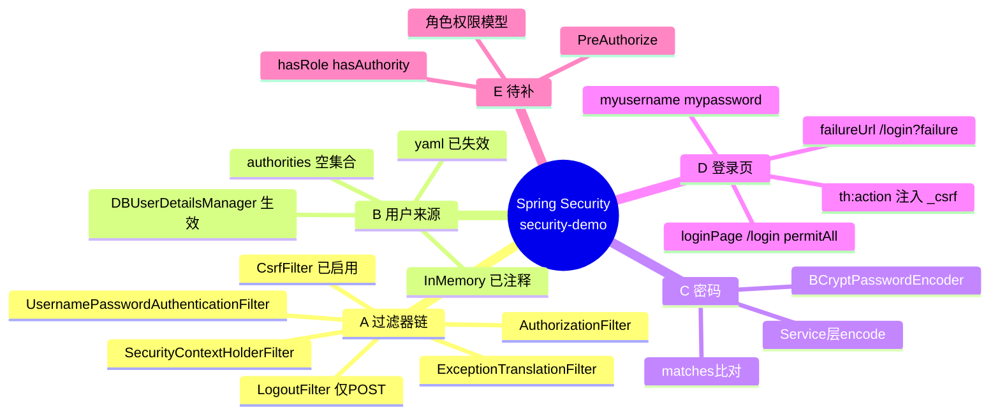

# security-demo

Spring Boot 3 + Spring Security 6 的学习仓库。目标不是做一个完整后台，而是把 Spring Security 的几个支点逐个换掉：默认拦截 → YAML 配用户 → 数据库取用户 → 密码加密 → 自定义登录页 + 恢复 CSRF。

**当前它只完成了「认证」，还没有做「授权」** —— 登录进去的用户权限列表是空的，安全规则只有一句 `anyRequest().authenticated()`。详见 [第 8 节](#8-下一步从认证走到授权)。

| | |
| --- | --- |
| Spring Boot | 3.5.8（`spring-boot-starter-parent`） |
| Spring Security | 6.5.7（由 Boot 统一管理） |
| JDK | 21 |
| 持久层 | MyBatis-Plus 3.5.17 + MySQL 8.0 |
| 视图 | Thymeleaf（含 `thymeleaf-extras-springsecurity6`） |
| 其他 | Lombok、knife4j-openapi3 4.5.0（仅引依赖，未配置） |
| 访问入口 | `http://localhost:8080/demo/`（`server.servlet.context-path=/demo`） |

---

## 目录

1. [快速开始](#1-快速开始)
2. [项目结构](#2-项目结构)
3. [思维导图](#3-思维导图)
4. [四个支点](#4-四个支点)
5. [接口与安全规则对照](#5-接口与安全规则对照)
6. [实测记录](#6-实测记录)
7. [已知问题](#7-已知问题)
8. [下一步：从认证走到授权](#8-下一步从认证走到授权)
9. [演进对照](#9-演进对照)

---

## 1. 快速开始

### 1.1 数据库

`security-demo` 库、`user` 表。下面是本机 `SHOW CREATE TABLE` 的真实结果，直接用它建：

```sql
CREATE DATABASE IF NOT EXISTS `security-demo` DEFAULT CHARSET utf8mb4 COLLATE utf8mb4_0900_ai_ci;
USE `security-demo`;

CREATE TABLE `user` (
  `id`       int NOT NULL AUTO_INCREMENT,
  `username` varchar(50)  DEFAULT NULL,
  `password` varchar(500) DEFAULT NULL,
  `enabled`  tinyint(1) NOT NULL,
  PRIMARY KEY (`id`),
  UNIQUE KEY `user_username_uindex` (`username`)
) ENGINE=InnoDB DEFAULT CHARSET=utf8mb4 COLLATE=utf8mb4_0900_ai_ci;
```

表名 `user` 由 MyBatis-Plus 的「驼峰转下划线」策略从实体 `User` 推导，实体没写 `@TableName`。

**`password` 里必须存 BCrypt 密文**，否则登录不了（`BCryptPasswordEncoder.matches` 对明文永远返回 false）。要一个能确定登进去的账号，插这一行（密码 `123456`，密文由 `BCryptPasswordEncoder` 真实生成并 `matches` 回验过）：

```sql
INSERT INTO `user` (username, password, enabled)
VALUES ('demo', '$2a$10$6bXYvRC569TQclTaQ0b/6OU1Dyz0PThAEeG.MbnxSxxFBrTTBTXSC', 1);
```

> 为什么不能靠 `/user/save` 接口来自举：它也落在 `anyRequest().authenticated()` 之下，登录又要求库里已有用户，两者互为前置。要打通注册，先给 `/user/save` 加 `permitAll()`。

### 1.2 连接配置

`application.yaml` 里写死了本机口令（`root / 123456`），换环境要改 `username`/`password`。URL 用 `jdbc:mysql:///security-demo`，省略 host 即本机；`security-demo` 含连字符，所以库名不能省。

⚠️ 这是真实口令，仓库若设为 public 会一并公开。生产/公开场景请改用环境变量占位（`${MYSQL_PASSWORD}`）并把该文件的历史提交也换掉。

### 1.3 启动

IDEA 里直接跑 `SecurityDemoApplication` 最省事。命令行跑要注意两个环境坑：

```bash
# 坑 1：PATH 上的 java 是 JDK 17，而 pom 要求 21
export JAVA_HOME="D:/dev/jdk/jdk21.0.12.1"
# 坑 2：命令行 mvn 的本地仓库和 IDEA 不是同一个
mvn spring-boot:run -Dmaven.repo.local=D:/dev/maven/apache-maven-3.9.9/repository
```

### 1.4 验证清单

| 步骤 | 现象 |
| --- | --- |
| 访问 `http://localhost:8080/demo/` | 302 到 `/demo/login`，显示项目自己的登录页（不是框架默认那张） |
| 输错密码 | 302 到 `/demo/login?failure`，页面出现「错误的用户名和密码.」 |
| 用 `demo / 123456` 登录 | 302 回登录前访问的地址，看到 `Hello Security` |
| 访问 `/demo/user/list` | 已登录返回用户 JSON；注意响应里带 `password` 密文字段 |
| 点首页 `Logout1` | **登出不了**，见 [已知问题 1](#7-已知问题) |

第 1、2、5 行是第 6 节的实测结果；第 3、4 行（登录成功跳回原地址、`/user/list` 返回 JSON）是照配置推出来的，本机没有可用口令，我没有实跑。

---

## 2. 项目结构

```
src/main/java/com/ittxf/securitydemo
├── SecurityDemoApplication.java
├── config
│   ├── WebSecurityConfig.java        PasswordEncoder + SecurityFilterChain（规则都在这）
│   └── DBUserDetailsManager.java     数据库版 UserDetailsService / UserDetailsManager
├── controller
│   ├── IndexController.java          GET  /            → templates/index.html
│   ├── LoginController.java          GET  /login       → templates/login.html（自定义登录页）
│   └── UserController.java           GET  /user/list   POST /user/save
├── entity/User.java                  id / username / password / enabled
├── mapper/UserMapper.java            extends BaseMapper<User>
└── service
    ├── UserService.java              extends IService<User> + saveUserDetails
    └── impl/UserServiceImpl.java     先 encode 再交给 UserDetailsManager 落库

src/main/resources
├── application.yaml                  数据源、context-path=/demo、yaml 用户（已失效）、SQL 日志
├── mapper/UserMapper.xml             只声明 namespace，SQL 全走 BaseMapper
└── templates
    ├── index.html                    首页 + 两个 Logout 链接
    └── login.html                    登录表单：th:action 自动带 _csrf，字段名 myusername/mypassword

src/test/java/.../SecurityDemoApplicationTests.java   testPasswordEncoding：BCrypt 编码/校验演示
```

---

## 3. 思维导图

```
Spring Security（security-demo）
│
├── A. 请求进门要过的链 ──── 见 4.1
│   ├── SecurityContextHolderFilter   从 Session 取 SecurityContext
│   ├── CsrfFilter                    写操作校验 _csrf（现在已恢复启用）
│   ├── LogoutFilter                  默认只匹配 POST /logout
│   ├── UsernamePasswordAuthenticationFilter  POST /login，参数名被改成 myusername/mypassword
│   ├── ExceptionTranslationFilter    兜异常 → 未认证就丢给入口点
│   └── AuthorizationFilter           执行 anyRequest().authenticated()
│
├── B. 用户从哪来（UserDetailsService）──── 见 4.2
│   ├── ① yaml：spring.security.user.name=admin password=123      → 已被覆盖，留着会误导
│   ├── ② 内存：InMemoryUserDetailsManager（WebSecurityConfig 里注释保留）
│   └── ③ 数据库：DBUserDetailsManager ★当前生效
│       ├── loadUserByUsername → user 表 → 组装 UserDetails
│       ├── authorities = new ArrayList<>()   ← 「能登录、无权限」的根因
│       └── UserDetailsManager 的增删改 / userExists / updatePassword 仍是空桩
│
├── C. 密码怎么算 ──── 见 4.3
│   ├── PasswordEncoder Bean = BCryptPasswordEncoder（工作因子默认 10）
│   ├── 写：UserServiceImpl 里 encode() → createUser 原样插入
│   └── 读：DaoAuthenticationProvider 里 matches() 比对库中密文
│
├── D. 登录页与 CSRF ──── 见 4.4
│   ├── formLogin(loginPage("/login").permitAll())     框架不再提供默认页
│   ├── usernameParameter / passwordParameter 自定义
│   ├── failureUrl("/login?failure") + login.html 的 ${param.failure}
│   ├── LoginController 只是把 GET /login 映射到模板，不含任何校验逻辑
│   └── csrf 已恢复启用（disable 那行注释掉了）→ th:action 自动注入 _csrf
│
├── E. 还没做
│   ├── 角色/权限模型（库里只有 user 表，没有 role/permission）
│   ├── hasRole / hasAuthority / @PreAuthorize
│   └── 注册接口 permitAll、退出登录按钮的正确写法
│
└── F. 部署形态
    ├── server.servlet.context-path=/demo   所有路径带前缀，含安全规则的匹配基准
    └── 8080 端口，Servlet 容器 = Tomcat（starter-web）
```

Mermaid 版（GitHub 会渲染）：



---

## 4. 四个支点

### 4.1 请求进门要过的链

`spring-boot-starter-security` 一引入，`FilterChainProxy` 就挂进 Servlet 过滤器链，默认策略是所有请求都要认证。本项目通过 `WebSecurityConfig.filterChain()` 定制这条链：

```
GET /demo/（未登录）
 └─ SecurityContextHolderFilter    Session 里没有 SecurityContext → 匿名身份
 └─ ... 各业务过滤器直通 ...
 └─ AuthorizationFilter             命中 anyRequest().authenticated() → AccessDeniedException
     └─ ExceptionTranslationFilter  发现身份是匿名 → 不报 403，改为发起认证
         └─ LoginUrlAuthenticationEntryPoint  把 /demo/ 存进 RequestCache
             └─ 302 Location: /demo/login

POST /demo/login（带 _csrf、myusername、mypassword）
 └─ CsrfFilter                                  token 不对就直接 AccessDeniedException
 └─ UsernamePasswordAuthenticationFilter        按自定义参数名取值
     └─ ProviderManager → DaoAuthenticationProvider
          ├─ DBUserDetailsManager.loadUserByUsername → user 表
          ├─ BCryptPasswordEncoder.matches(明文, 库中密文)
          └─ 账号状态检查：库里 enabled=0 → DisabledException（本项目只有这一项是真会碰到的）
 └─ 成功：UsernamePasswordAuthenticationToken（authorities 取自 UserDetails，现在为空）
        → SecurityContextHolder → 写入 Session（换发新 Session ID 防会话固定，CSRF token 一并搬到新会话）
        → 302 回 RequestCache 里的 /demo/
 └─ 失败：302 /demo/login?failure

已登录后再 GET /demo/  └─ AuthorizationFilter 放行 → IndexController → index.html
```

### 4.2 用户从哪来：三种方案，只有一种生效

| 方案 | 位置 | 状态 |
| --- | --- | --- |
| YAML 用户 | `spring.security.user.name/password` | **已失效**。容器里出现自定义 `UserDetailsService` 后，Boot 的 `UserDetailsServiceAutoConfiguration` 直接退让 |
| 内存用户 | `WebSecurityConfig` 里注释掉的 `InMemoryUserDetailsManager` | 未启用。它的价值是示范 `roles("USER")` 怎么塞权限 |
| 数据库用户 | `DBUserDetailsManager`（`@Component`） | **生效中** |

`DBUserDetailsManager` 方法签名里没出现 `UserDetailsService`，却被框架当成取用户的入口，原因是一条继承关系：

```java
public class DBUserDetailsManager implements UserDetailsManager, UserDetailsPasswordService
//                                    ↑ 继承链上是 UserDetailsService
```

于是它是容器里唯一的 `UserDetailsService` Bean。`InitializeUserDetailsBeanManagerConfigurer` 用它构造 `DaoAuthenticationProvider`，并注入 `BCryptPasswordEncoder`；同时它也作为 `UserDetailsPasswordService` 存在（隐患见第 7 节第 5 条）。

`loadUserByUsername` 的返回里有四个布尔 + 一个权限集合：

```java
new User(username, password, enabled /*账号是否可用*/,
         true /*accountNonExpired*/, true /*credentialsNonExpired*/, true /*accountNonLocked*/,
         new ArrayList<>() /* ← 权限为空，一切授权玩法都从这里开始 */);
```

### 4.3 密码怎么算

- `BCryptPasswordEncoder` 作为 Bean 暴露，`DaoAuthenticationProvider` 自动拿它做 `matches`。
- **加密发生在 `UserServiceImpl.saveUserDetails`**，`DBUserDetailsManager.createUser` 只负责把传进来的字符串原样入库。绕过 Service 直接 `createUser` 就是明文入库。
- BCrypt 特性：自带随机盐，同一明文每次密文不同；工作因子越大越慢（默认 10，测试用例里用 `BCryptPasswordEncoder(4)` 求快）；密文恒为 60 字符，成本记在串里（`$2a$10$...`），所以库里存 `varchar(500)` 完全够。
- 库里既有的 4 行数据 `password` 长度都是 60，是合规的 BCrypt 密文；但密文不可逆，没人知道你当初设的明文是什么，忘了就重新插一行种子数据。

### 4.4 自定义登录页与 CSRF

`formLogin` 从 `withDefaults()` 换成了 lambda 配置，五行改完行为就变了：

```java
.formLogin(form -> form
    .loginPage("/login")              // 不再用框架自带页；未登录一律 302 到这里
    .permitAll()                      // 这张登录页自己免认证，否则永远跳不进去
    .usernameParameter("myusername")  // 覆盖默认的 username
    .passwordParameter("mypassword")  // 覆盖默认的 password
    .failureUrl("/login?failure")     // 失败不再走默认 /login?error
);
```

`LoginController` 只有一行 `return "login"`，**不含任何校验逻辑**：页面归 MVC，处理 `POST /login` 的仍是链上的 `UsernamePasswordAuthenticationFilter`。这也是 Spring Security 的常规分工——页面上 `action` 指向 `/login` 就够了。

`login.html` 里两个容易踩空的点：

```html
<form th:action="@{/login}" method="post">   <!-- 必须 POST；th:action 才会注入 _csrf 且自动带 /demo 前缀 -->
  <input type="text" name="myusername"/>     <!-- name 必须与 usernameParameter 一致 -->
  <input type="password" name="mypassword"/>
```

`csrf.disable()` 已注释掉，CSRF 保护回来了，代价是：

1. 所有写请求（`POST /login`、`POST /user/save`、`POST /logout`）都要带 token。
2. `th:action` 的表单会自动生成 `<input type="hidden" name="_csrf" value="...">`（实测见第 6 节），普通 `<a href>` 不会。
3. 顺带改变了退出登录的匹配规则：`LogoutConfigurer` 在 CSRF 启用时只匹配 `POST /logout`，CSRF 禁用时才放宽到 GET/PUT/DELETE。所以首页那两个 GET 链接现在点不动了（7.1）。

---

## 5. 接口与安全规则对照

所有路径都要带 `/demo` 前缀（`context-path`）。

| 方法 | 路径 | 安全要求 | 说明 |
| --- | --- | --- | --- |
| GET | `/demo/` | `authenticated()` | → `index.html` |
| GET | `/demo/login` | `permitAll()` | `LoginController` → `login.html` |
| POST | `/demo/login` | 免认证（框架接管） | 参数 `myusername`/`mypassword` + `_csrf` |
| GET | `/demo/user/list` | `authenticated()` | 返回全部用户，含 `password` 密文 |
| POST | `/demo/user/save` | `authenticated()` | JSON 体 + 请求头 `X-CSRF-TOKEN`；密码由 Service 层加密 |
| POST | `/demo/logout` | `authenticated()`（GET 不再生效） | 需要 `_csrf`；按配置成功后 302 到 `/demo/logout?success`（登录成功链路未实测） |
| GET | `/demo/doc.html` | `authenticated()` | knife4j 未配置，且被安全规则挡住 |

`anyRequest().authenticated()` 是兜底规则，所以 `/user/save`、`/user/list` 全都要求登录——包括注册。

---

## 6. 实测记录

2026-09-22 对着本机正在运行的实例（JDK 21、MySQL 8.0、`/demo` 上下文）实测，只做了读操作和失败登录，没有写入任何数据。

| 探针 | 结果 | 结论 |
| --- | --- | --- |
| `GET /demo/` | `302 → /demo/login` | 认证入口点 + context-path 生效 |
| `GET /`（不带 `/demo`） | `404` | 应用不在根路径 |
| `GET /demo/login` | 返回 `<form action="/demo/login" method="post"><input type="hidden" name="_csrf" value="…">`，字段名 `myusername`/`mypassword` | CSRF 启用；`th:action` 确实自动注入 token；自定义参数名生效 |
| `POST /demo/login`（带 token、错误密码） | `302 → /demo/login?failure` | 表单被 `UsernamePasswordAuthenticationFilter` 正常受理；`failureUrl` 生效 |
| `GET /demo/login?failure` | 页面出现「错误的用户名和密码.」 | `${param.failure}` 判断生效 |
| `GET /demo/logout` | `302 → /demo/login`（**不是** `/demo/logout?success`） | `LogoutFilter` 未匹配 GET → 首页 GET 链接失效 |
| `POST /demo/login`（无 token 或 token 错） | `302 → /demo/login`，**不带** `?failure` | `CsrfFilter` 先拒绝，请求根本没到认证逻辑。据此可区分「CSRF 没过」和「账号密码错」 |
| `POST /demo/logout`（无 token） | `302`（不是 403） | CSRF 校验先失败；未认证时被当成「发起认证」而非报错 |
| 同一个 token 连着用两次 | 两次都被受理；但重新 GET 登录页时渲染出的 token 字符串变了 | Spring Security 6 默认对渲染值做 XOR 掩码（防 BREACH），每次页面都不同、却都对应会话里同一个 token。**别把 token 当常量硬编码**，但同一会话里先前拿到的 token 依然可用 |
| `GET /demo/user/list`、`/demo/doc.html`、`/demo/v3/api-docs` | 全部 `302 → /demo/login` | 未登录时接口与文档入口都不可见 |

**未验证（本机没有可用口令，避免乱猜）**：

- 已登录后访问 `/demo/user/list` 的真实响应体、注册链路的端到端；
- 已登录时 `GET /demo/logout` 的具体状态码。按过滤器链推断是 404（`LogoutFilter` 不匹配，MVC 又没有该映射），但这是推断不是实测；
- 登录后 `knife4j` 的 `/demo/doc.html` 是否可用。

带会话的复现命令（自己换个能登录的账号）。同一会话里先前取到的 token 可以一直用（实测见上表），所以下面 `$T` 取一次用到底；只有第 2 步真正登录成功之后的那一段我没能实测（缺可用口令），因为换会话后 token 的迁移逻辑没有验证过。

```bash
BASE=http://localhost:8080/demo

# 1) 取登录页 + 会话 cookie + CSRF token
curl -s -c jar.txt "$BASE/login" -o login.html
T=$(grep -o 'name="_csrf" value="[^"]*' login.html | sed 's/.*value="//')

# 2) 表单登录（参数名是自定义的 myusername/mypassword）
curl -s -b jar.txt -c jar.txt -X POST "$BASE/login" \
  --data-urlencode "myusername=demo" --data-urlencode "mypassword=123456" \
  --data-urlencode "_csrf=$T" -o /dev/null -w "%{http_code} -> %{redirect_url}\n"

# 3) 带会话访问接口
curl -s -b jar.txt "$BASE/user/list"

# 4) 注册：JSON 体的接口要把 token 放请求头（CsrfFilter 认 X-CSRF-TOKEN）
curl -s -b jar.txt -c jar.txt -X POST "$BASE/user/save" \
  -H "Content-Type: application/json" -H "X-CSRF-TOKEN: $T" \
  -d '{"username":"bob","password":"123456","enabled":true}' -w "\n%{http_code}\n"

# 5) 退出：必须 POST
curl -s -b jar.txt -c jar.txt -X POST "$BASE/logout" \
  --data-urlencode "_csrf=$T" -o /dev/null -w "%{http_code} -> %{redirect_url}\n"
```

---

## 7. 已知问题

按「会不会马上咬到你」排序：

1. **首页两个 Logout 链接现在点了没反应。** `index.html` 里是 `<a th:href="@{/logout}">` 和 `<a href="/logout">`，都是 GET；CSRF 恢复后 `LogoutFilter` 只匹配 `POST /logout`（实测第 6 节）。第二个链接还额外少个 `/demo` 前缀，即使放宽成 GET 也打不到。改成 POST 表单，`th:action` 会自动带上 token：

   ```html
   <form th:action="@{/logout}" method="post" style="display:inline">
     <button type="submit">退出登录</button>
   </form>
   ```

2. **只做了认证，没做授权。** `authorities` 恒为空集合，安全规则只有 `authenticated()` 一条。现在任何登录用户能访问所有接口。
3. **空库自举死锁。** 唯一能写用户的 `/user/save` 也要登录，而登录需要库里已有用户。给 `/user/save` 加 `permitAll()`，或用 1.1 的种子 INSERT。
4. **注册接口没有防重复。** `createUser` 直接 `insert`，`userExists()` 恒返回 `false` 没人用；`username` 上有唯一索引，撞了会抛 `DuplicateKeyException`，而 `UserController.add` 返回 `void` 没有异常处理，届时会是 500（这条按代码推断，未实测）。
5. **`DBUserDetailsManager` 五个方法空着**：`updateUser`、`deleteUser`、`changePassword`、`userExists`（恒 `false`）、`updatePassword`（恒 `null`）。前四个只是功能缺失；`updatePassword` 是隐患——它同时是 `UserDetailsPasswordService` Bean，一旦库里某行密码不是 BCrypt 格式（`upgradeEncoding` 判 true），`DaoAuthenticationProvider` 会拿到 `null` 继续当 `UserDetails` 用，6.5.7 没做判空，直接 NPE。
6. **`/user/list` 把 `User` 实体直接序列化出去，带着 `password` 密文。** 换 VO/DTO 或加 `@JsonIgnore`。
7. **`application.yaml` 的 `spring.security.user` 是死配置**（4.2 解释了为什么失效），留着读起来容易误判。
8. **数据库口令明文躺在仓库里**，推公开仓库前请先确认是否要换成环境变量占位；另外 `.idea/` 目前**没有被 `.gitignore` 忽略**，而里面有 `dataSources.local.xml`（IDEA 的数据源信息），别顺手 `git add -A`。
9. **knife4j 只加了依赖没配置**，且 `/demo/doc.html` 被安全规则挡住，接口文档实际不可用。
10. 小清理：`WebSecurityConfig` 的 `import static ...Customizer.withDefaults` 现在只被注释行引用，可删。

---

## 8. 下一步：从认证走到授权

Spring Security 的授权判断读的是 `Authentication.getAuthorities()`，所以顺序必须是「先把权限装进 UserDetails，再让规则去读」：

1. 建表：`role`、`permission`、`user_role`、`role_permission`（先跑通 `user_role` 就够）。
2. 查权限：在 `loadUserByUsername` 里把用户权限查出来，映射成 `List<GrantedAuthority>`（`SimpleGrantedAuthority` 或 `AuthorityUtils.createAuthorityList`）替换那个 `new ArrayList<>()`。
3. 定规则：`WebSecurityConfig` 里在 `anyRequest()` **之前**按顺序加 `.requestMatchers("/user/**").hasRole("ADMIN")` / `.hasAuthority("user:list")`。顺序错了会被前面的规则先吃掉。
4. 方法级：`@EnableMethodSecurity` + `@PreAuthorize("hasAuthority('user:save')")`。
5. 收尾：`/user/save` 与登录页静态资源 `permitAll()`、Logout 改 POST、`updatePassword` 等空桩补实现。

`roles("USER")`（注释掉的内存方案里那种）会自动加 `ROLE_` 前缀，`hasRole("USER")` 匹配的是 `ROLE_USER`；`authorities("user:list")` 不加前缀，配 `hasAuthority`。这两者混用是新手期最容易的 403 来源。

---

## 9. 演进对照

| 提交 | 内容 |
| --- | --- |
| `9dc5dbe` 初始化 commit | Web + Thymeleaf 骨架，`IndexController`、`index.html` |
| `650488b` 使用 configuration 和 yaml 配置登录用户信息 | 引 starter；`WebSecurityConfig`（`PasswordEncoder`、`SecurityFilterChain`、`formLogin(withDefaults())`）；yaml 用户；注释版内存用户 |
| `a8b6f29` user 三层业务，查询到 user 数据 | MyBatis-Plus + MySQL 数据源；entity/mapper/service/controller；`GET /user/list` |
| `40637d2` 创建基于数据的用户信息管理器 | `DBUserDetailsManager` 实现 `UserDetailsManager` + `UserDetailsPasswordService`，`loadUserByUsername` 查库 |
| `1aa4b78` 增加新增用户功能 | `POST /user/save` → `saveUserDetails` → `createUser` 落库（此时还是明文入库） |
| `967632c` 密码加密算法以及校验规则 | `UserServiceImpl` 注入 `PasswordEncoder` 改为 encode 后落库；`csrf.disable()`；`testPasswordEncoding`；加 knife4j 依赖 |
| 本次提交 | `LoginController` + `login.html` 自定义登录页；`formLogin` 换 lambda（`loginPage`/`permitAll`/自定义参数名/`failureUrl`）；注释掉 `csrf.disable()` 恢复 CSRF；`context-path=/demo`；重写本文档 |
